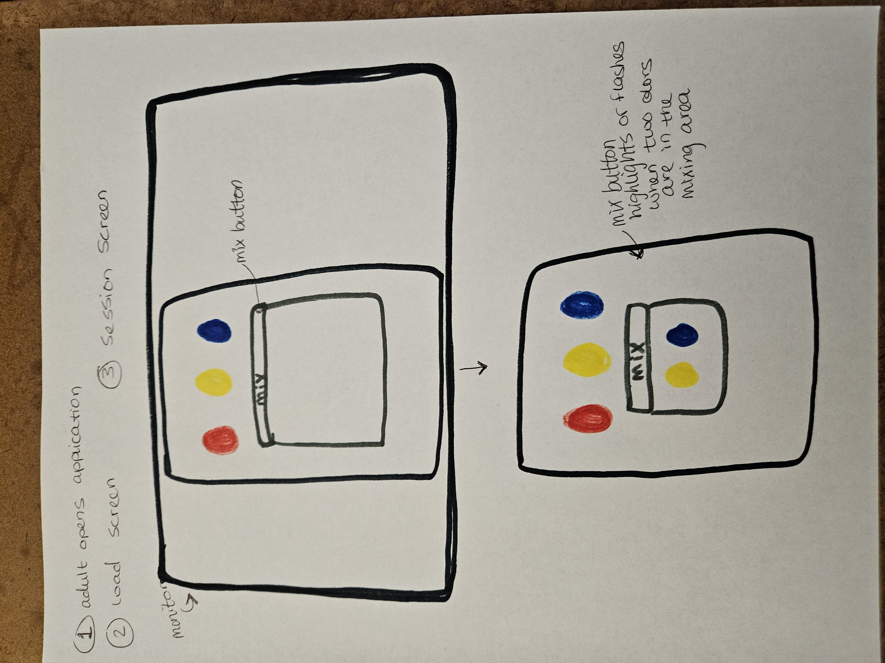
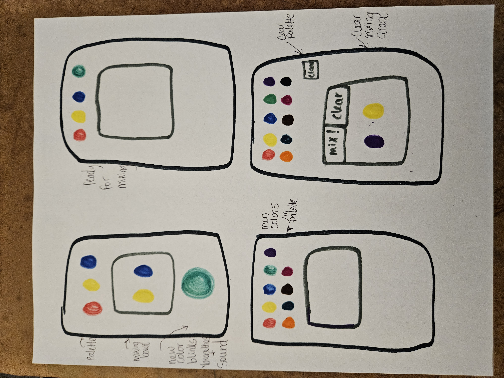
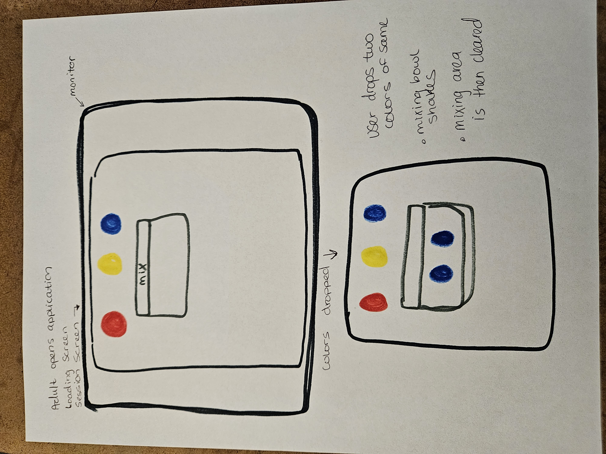

<!-- README.md -->

  <h1>MasterColorMixer</h1>
  
<em>A toddler-friendly color mixing web app built with Python 3.12+, FastAPI, and a simple web UI.</em>

<h2 id="toc">Table of Contents</h2>
<ol>
  <li><a href="#charter">Project Charter</a></li>
  <li><a href="#plan">Two-Sprint Plan</a></li>
  <li><a href="#backlog">Personal Backlog</a></li>
  <li><a href="#trends">Trends Note</a></li>
  <li><a href="#srs">Software Requirements Specification (SRS)</a></li>
  <li><a href="#include">Inclusivity Heuristic Review & Issues</a></li>
  <li><a href="#uml">UML Artifacts</a></li>
  <li><a href="#data">Data Model</a></li>
  <li><a href="#trace">Traceability Table</a></li>
  <li><a href="#run">How to Run Locally</a></li>
</ol>

<h2 id="charter">Project Charter</h2>

  <strong>Purpose:</strong> <em>MasterColorMixer</em>  project is a fun and educational color-mixing web application designed for toddlers (ages 2–5). This application will help introduce basic concepts of color theory and interaction in a safe and tidy, child-friendly interface. Children start with three base colors (red, blue, yellow) then drag and drop up to two colors at a time into a “mixing bin” to discover new colors. When a color object is clicked on, the app speaks the color's name; when a new color is discovered, its name is spoken as immediate feedback. The experience promotes early learning by connecting visual play with auditory reinforcement while modeling SOLID software engineering practices.

  <strong>Objectives:</strong> 
  <ul>
    <li>Provide an interactive learning experience for toddlers focused on colors</li>
    <li>Deliver a Python 3.12+ service exposing a versioned HTTP API via FastAPI</li>
    <li>Implement a small, accessible web UI</li>
    <li>Support CRUD and persistence with a lightweight database</li>
    <li>Demonstrate Agile and SDLC principles in a Python-based application</li>
    <li>Provide clear documentation, tests, and a one-command local run</li>
    <li>The MVP aims for up to 20 unlockable colors, a reset (“Clear”) function for the mixing area, and reliable text-to-speech for color names</li>
      <ol>
        <li>base palette (red, blue, yellow)</li>
        <li>drag-and-drop of exactly two colors into a mixing area</li>
        <li>generation and display of the mixed color</li>
        <li>unlocking and persisting newly discovered colors (up to 20 total)</li>
        <li>a “Clear” control to reset the mix area</li>
        <li>audible color names on tap/click and post-mix using text-to-speech libraries like pyttsx3</li>
        <li>The API provides color resources, text to speech () and mixing operations</li>
        <li>the database persists unlocked colors by session/user</li>
      </ol>
  </ul>

  <strong>Stakeholders:</strong> 
  <ul>
  <li>Primary Stakeholders: Toddlers ages 2-5</li>
  <li>Secondary Stakeholders: Parents or Teachers supervising play and/or tracking progress</li>
  <li>Developer: Amanda Crotty, solo developer for this COP4504 - October 2025 course, responsible for planning, implementation, and maintenance</li>
  <li>Instructor: Franklin Castillo, course facilitator providing guidance and evaluation based on SDLC & Agile adherence</li>
  </ul>

  <strong>Risks:</strong> 
  <ul>
    <li>Time constraint: balance coursework and implementation with approximately 18 hours per week</li>
    <li>Scope creep: avoid adding advanced game mechanics outside of the MVP scope</li>
    <li>Accesibility: Ensuring sound playback, visiaul clarity, and color contrasts are toddler appropriate</li>
    <li>Dependency management: managing virtual environments and python package versions</li>
  </ul>

  <strong>Success Criteria:</strong> 
  <ul>
    <li>The application supports all MVP features:
        <ul>
        <li>Start the game with 3 basic colors (red, blue, yellow)</li>
        <li>Play color names aloud on click and when a new color is formed</li>
        <li>Allow for drag-and-drop mixing of two colors as combinations are discovered</li>
        <li>Unlock up to 20 colors as combinations are discovered</li>
        <li>Support clear functionality to reset the mixing area</li>
        <li>Support clear functionality to reset the game area to the basic colors without restarting the application</li>
      </ul>
    </li>
    <li>Code is modular and includes unit tests</li>
    <li>Documentation is complete (README, CONTRIBUTING, SRS traceability)</li>
    <li>App deploys and runs locally via command: TBD</li>
  </ul>

<h2 id="plan">Two-Sprint Plan</h2>

<h3>Sprint 1 (Weeks 2–4) Requirements, Design, Decisions, Inclusivity & Skeleton</h3>
<ul>
  <li><strong>Week 2 (SRS & UML)</strong>
    <ul>
      <li>Write the SRS:
        <em>scope, stakeholders, assumptions, functional & nonfunctional requirements, acceptance criteria, glossary</em>.</li>
      <li>Create <strong>1 Class Diagram</strong> (domain + interfaces) and <strong>2 Sequence Diagrams</strong> (core use cases, each with one alternative path).</li>
      <li>Build the <strong>traceability table</strong> (REQ-IDs → classes → sequence diagrams → planned tests).</li>
      <li>Update README to include SRS, UML, and traceability.</li>
    </ul>
  </li>
  <li><strong>Week 3 (ADR & Paper Prototype)</strong>
    <ul>
      <li>Write <code>docs/adr/0001-architecture.md</code> (Lightweight ADR format):
        <em>context, decision (monolith), status, consequences, risks, alternatives</em>.</li>
      <li>Create paper prototype walkthroughs for <strong>two end-to-end tasks</strong> (happy path + one alternative path each). Tag steps with related REQ-IDs.</li>
      <li>Update UML & README per ADR constraints and prototype findings; list what changed and which REQ-IDs are supported.</li>
    </ul>
  </li>
  <li><strong>Week 4 (Inclusivity & Project Skeleton)</strong>
    <ul>
      <li>Run an <strong>Inclusivity Heuristic Review</strong> on the two tasks:
        document heuristic, affected screen/step, related REQ-ID, severity, proposed fix, plus 2–4 annotated screenshots.</li>
      <li>Submit a <strong>prioritized issue list</strong> (top 5) with target sprint + acceptance criteria.</li>
      <li>Commit the <strong>project skeleton</strong>:
        repo structure, package layout, stub <em>main/API</em> module, README quickstart that runs “hello” locally, and a <strong>tests/</strong> folder with one passing placeholder test.</li>
    </ul>
  </li>
</ul>

<h3>Sprint 2 (Weeks 5–7) Core Implementation, Data Structures/Algorithms, Quality & Feature PR</h3>
<ul>
  <li><strong>Week 5 (Data Structures & Benchmarks)</strong>
    <ul>
      <li>Create <code>ds/</code> with <em>DynamicArray, Stack, RingBufferQueue, HashSet</em> APIs.</li>
      <li>Add Unit Tests <code>tests/test_ds.py</code></li>
      <li>Add <code>bench/bench_ds.py</code> with timeit microbenchmarks.</li>
      <li>Write a ~500-word analysis mapping Big-O expectations to empirical results, including methods and complexities table.</li>
    </ul>
  </li>
  <li><strong>Week 6 (Algorithms & Quality Assessment)</strong>
    <ul>
      <li>Implement <em>binary search, mergesort, quicksort</em> in <code>alg/</code>; exercise at least one in the app path (e.g., sorting palette).</li>
      <li>Write a ~500-word quality assessment memo citing concrete smells/hotspots with evidence and a justified change/no-change decision.</li>
      <li>Add unit tests for algorithm paths and any hotspot discussed, with pass fail results.</li>
    </ul>
  </li>
  <li><strong>Week 7 (Ship Major Feature, PR Workflow, Debugging)</strong>
    <ul>
      <li>Implement a <strong>major feature</strong> tied to <strong>≥3 REQ-IDs</strong> (e.g., unlock logic up to 20 colors, mixing rules, and Text-To-Speech feedback).</li>
      <li>Work on a feature branch → open PR → self-review → merge.</li>
      <li>Add characterization + unit tests (include one initially failing edge case).</li>
      <li>Use <code>pdb</code> to isolate/fix one defect; document commands used and lessons learned.</li>
    </ul>
  </li>
</ul>

<em>Week 8 (post-sprint):</em> Final integration, passing test suite, documentation pack in <code>docs/</code>, short user guide, packaging instructions, presentation video, and a release tag.

<h2 id="backlog">Personal Backlog</h2>

<table>
  <thead>
    <tr>
      <th>ID</th><th>User Story</th><th>Acceptance Criteria</th>
    </tr>
  </thead>
  <tbody>
    <tr><td>US01</td><td>As a developer, I want to define the project’s **purpose, stakeholders, risks, and success criteria**, so that I have a clear charter for my project.</td><td>
      A 500-word Project Charter exists in README.md and covers all four required sections.</td></tr>
    <tr><td>US02</td><td>As a developer, I want to **create an SRS (scope, requirements, and traceability)** so that all future work is tied to testable REQ-IDs.</td><td>
      SRS (750–1000 words) includes numbered REQ-IDs, class + sequence diagrams, and traceability table.</td></tr>
    <tr><td>US03</td><td>As a developer, I want to **choose an architecture (monolith or microservice)** and document it, so that implementation is consistent and justified for a solo project.</td><td>
      ADR created in `/docs/adr/0001-architecture.md` following lightweight ADR format with context, decision, consequences, and rationale.</td></tr>
    <tr><td>US04</td><td>As a developer, I want to **prototype the main user flow** (mixing two colors and hearing a sound), so that I can validate usability before coding.</td><td>
      Two paper prototype walkthroughs (each with an alternative path) included in README, tagged to REQ-IDs.</td></tr>
    <tr><td>US05</td><td>As a developer, I want to **evaluate inclusivity and accessibility** of my UI flows, so that the app is usable for all toddlers.</td><td>
      Inclusivity heuristic review documented with REQ-IDs, severity, proposed fixes, and annotated screenshots.</td></tr>
    <tr><td>US06</td><td>As a developer, I want to **establish a working project skeleton** (repo, packages, “hello world” endpoint, and passing test), so that I have a base to build upon.</td><td>
      Directory structure created with FastAPI `main.py`, test placeholder passes, quickstart instructions verified.</td></tr>
    <tr><td>US07</td><td>As a user, I want to see 3 base colors so I can start mixing.I want to hear a color’s name on tap/click.</td><td>
      On load, 3 color spheres appear; each clickable; clicking any sphere triggers correct audio output.</td></tr>
    <tr><td>US08</td><td>As a user, I want to drag exactly two colors into a bowl to mix. I want to be able to move a color out of the bowl.</td><td>
      UI drag-drop works with exactly two inputs; third color blocked.</td></tr>
    <tr><td>US09</td><td>As a user, I want to **see and hear the name of the mixed color**, so that I can connect color and language learning.</td><td>
      API returns hex + name; new sphere displays in bowl.</td></tr>
    <tr><td>US10</td><td>As a user, I want to **unlock and save new colors** (up to 20 total) so that I can expand my palette.</td><td>
      SQLite session stores unlocked colors; capped at 20;</td></tr>
    <tr><td>US11</td><td>As a user, I want to **reset the mixing area** so that I can start a new mix anytime.I want to **reset the color palette** so that I can "discover" colors again.</td><td>
      “Clear” button resets UI and re-enables drag-drop; "Clear Palette" button reset the color palette to the basic colors.</td></tr>
    <tr><td>US12</td><td>As a developer, I want to **analyze and benchmark data structures** (DynamicArray, Stack, Queue, HashSet), so I can choose efficient tools for my app.</td><td>
      DS package implemented with tests and timeit benchmarks; analysis report (~500 words) included.</td></tr>
    <tr><td>US13</td><td>As a developer, I want to **implement core algorithms** (binary search, mergesort, quicksort), so that I can sort or search within my color data efficiently.</td><td>
      Algorithms coded in `alg/` package; at least one used in app; tested and documented in quality memo.</td></tr>
    <tr><td>US14</td><td>As a developer, I want to **perform a quality assessment and refactor if needed**, so that the final codebase is maintainable and evidence-based.</td><td>
      500-word memo with smells/hotspots evidence; either change or defend no change; all tests passing.</td></tr>
    <tr><td>US15</td><td>As a developer, I want to **add a major feature tied to ≥3 REQ-IDs** and merge it through a full PR workflow, so that my app grows incrementally and professionally.</td><td>
      Major feature branch → PR → review → merge; feature implements at least 3 REQ-IDs; self-review note included.</td></tr>
    <tr><td>US16</td><td>As a developer, I want to **debug one real issue using `pdb`**, so I can practice professional debugging techniques.</td><td>
      Short note included with commands and lesson learned.</td></tr>
    <tr><td>US17</td><td>As a developer, I want to **assemble final documentation, tests, and presentation**, so that my final submission meets all Week 8 deliverables.</td><td>
      Final docs (SRS, UML, ADR, inclusivity review, DS/alg results, user guide, and 5-min video) committed and release tagged.</td></tr>
  </tbody>
</table>

<h2 id="trends">Trends Note</h2>

  Educational apps have shifted from install-heavy desktops to accessible, browser-first experiences. This project follows modern patterns: a lightweight async API (FastAPI), local persistence (SQLite), and a minimal web UI with drag-and-drop. Text-To-Speech (TTS) is supported via a small Python library (pyttsx3).

  <strong>Past Practices:</strong>
  In my professional experience as a full-stack developer for over four years, working on a large-scale web application built with <em>C#, Azure, SQL, and Angular</em>. We operated in a highly Agile environment using the <em>Scrum framework</em>. We held daily stand-ups, bi-weekly user story refinement sessions, bi-weekly sprint planning sessions, and quarterly retrospective sessions to coordinate our efforts to being Agile. This structure created rhythm and accountability, but it also showed the problems in scaling Agile within multi-team settings. This was especially pronounced when management wanted to leverage parallel development, or overlapping of ownership caused dependencies across sprints. My experiences as a professional taught me that Agile is most effective when roles, responsibilities, and communication channels remain clear, as well as when iteration speed is balanced with thoughtful coordination.

  <strong>Current Practices:</strong>
    The industry has moved more toward <em>Agile methodologies</em>. Modern development emphasizes short, iterative cycles, working software with minimal documentation (API documentation is necessary), and close collaboration between developers. Scrum and other frameworks encourage time-boxed sprints, clear roles, and continuous stakeholder input. In this solo project, Agile principles remain valuable. I will use: User stories to define scope, sprints create cadence, and retrospectives improve focus. I will apply these practices by maintaining a living backlog, writing user stories, and conducting sprint reviews by analysing notes for each week, at the end of Weeks 4 and 7, to assess progress, quality, and lessons learned. 

  <strong>Near-Future Practices:</strong>
  Agile is evolving toward automation. Tools now automate backlog grooming, peer reviews, test coverage, and pipeline builds/releases. I intend to mirror this direction by using lightweight automation—version control, task tracking, and continuous testing to maintain visibility and reliability in my solo workflow. 

  <strong>Adopted Approach:</strong>
  For this 8-week course, I will combine Agile’s adaptability with disciplined documentation from traditional SDLC. Each sprint will conclude with tangible deliverables and showcase modern project management.

<h2 id="srs">Software Requirements Specification (SRS)</h2>

<h3>1. Scope</h3>

  <em>MasterColorMixer</em> is an educational color-mixing web application designed for toddlers (ages 2–5). The goal is to teach basic color recognition and mixing concepts through play. Users interact with draggable color “spheres,” mix them in a bowl, and hear the resulting color name through text-to-speech. The system provides a safe, intuitive, and accessible environment that supports up to 20 unlockable colors. The application demonstrates solid software design and modern Agile/SDLC practices within a small-scale, single-developer project.

<h3>2. Stakeholders</h3>
<ul>
  <li><strong>Primary Users:</strong> Toddlers aged 2–5 who will interact visually and audibly with the color-mixing UI.</li>
  <li><strong>Secondary Stakeholders:</strong> Parents, guardians, or teachers who supervise use and evaluate learning value.</li>
  <li><strong>Developer:</strong> Amanda Crotty – responsible for design, implementation, testing, and documentation.</li>
  <li><strong>Instructor:</strong> Franklin Castillo – academic evaluator ensuring deliverables meet SDLC and Agile standards.</li>
</ul>

<h3>3. Assumptions and Constraints</h3>
<ul>
  <li>The application will be developed and tested locally using Python 3.12+, FastAPI, and a minimal browser-based front-end.</li>
  <li>No external backend or authentication will be used; local persistence will rely on SQLite or JSON storage.</li>
  <li>The UI must function on standard desktop browsers and ideally touchscreen devices (tablet, PC, or hybrid PCs).</li>
  <li>All text-to-speech operations use a local library (<code>pyttsx3</code>) to avoid internet dependency.</li>
  <li>The system must remain simple enough to deploy in a classroom or home environment without technical setup.</li>
  <li>The project is constrained to an 8-week academic sprint cycle, with an average of 18 hours per week available.</li>
</ul>

<h3>4. Functional Requirements</h3>

<ol>
  <li id="REQ-1"><strong>REQ-1:</strong> The system shall display three base colors (red, blue, yellow) upon startup.</li>
  <li id="REQ-2"><strong>REQ-2:</strong> The user shall be able to click or tap a color sphere to hear its spoken name.</li>
  <li id="REQ-3"><strong>REQ-3:</strong> The user shall be able to drag and drop up to two color spheres into a mixing area.</li>
  <li id="REQ-4"><strong>REQ-4:</strong> When two colors are mixed, the system shall generate a resulting color using a mixing algorithm and display the new color sphere.</li>
  <li id="REQ-5"><strong>REQ-5:</strong> The system shall play the mixed color’s spoken name immediately after mixing.</li>
  <li id="REQ-6"><strong>REQ-6:</strong> The system shall store discovered colors (up to 20 total) in a persistent local session.</li>
  <li id="REQ-7"><strong>REQ-7:</strong> The user shall have a “Clear Mix” button to reset the mixing bowl without restarting the app.</li>
  <li id="REQ-8"><strong>REQ-8:</strong> The user shall have a “Clear Palette” button to reset all unlocked colors to the three base colors.</li>
  <li id="REQ-9"><strong>REQ-9:</strong> The application shall expose an HTTP API (FastAPI) supporting color retrieval, mix operations, and TTS requests.</li>
  <li id="REQ-10"><strong>REQ-10:</strong> The application shall support accessibility by maintaining high-contrast visuals and audible reinforcement.</li>
  <li id="REQ-11"><strong>REQ-11:</strong> The system shall handle invalid or excessive drag events gracefully (prevent mixing three colors).</li>
  <li id="REQ-12"><strong>REQ-12:</strong> The system shall provide feedback (sound or UI highlight) when actions are completed successfully or blocked.</li>
  <li id="REQ-13"><strong>REQ-13:</strong> The system shall use a simple color-mixing algorithm that maps RGB averages or predefined combinations.</li>
  <li id="REQ-14"><strong>REQ-14:</strong> The developer shall provide a complete set of unit tests for API endpoints, color logic, and persistence.</li>
  <li id="REQ-15"><strong>REQ-15:</strong> The system shall be runnable locally with one command (<code>python main.py</code>).</li>
</ol>

<h3>5. Nonfunctional Requirements</h3>
<ol>
  <li id="REQ-16"><strong>REQ-16:</strong> Performance – App shall respond to user input (drag, click, or mix) within 500ms on a typical desktop or tablet.</li>
  <li id="REQ-17"><strong>REQ-17:</strong> Usability – UI elements shall be large enough for toddler interaction (minimum 100px diameter color spheres).</li>
  <li id="REQ-18"><strong>REQ-18:</strong> Accessibility – Colors shall maintain contrast ratios suitable for visual accessibility.</li>
  <li id="REQ-19"><strong>REQ-19:</strong> Reliability – App shall preserve unlocked colors across restarts within a session.</li>
  <li id="REQ-20"><strong>REQ-20:</strong> Maintainability – Code shall follow modular and SOLID principles to allow easy modification or testing.</li>
  <li id="REQ-21"><strong>REQ-21:</strong> Portability – App shall run cross-platform (Windows, macOS, Linux) with minimal setup.</li>
  <li id="REQ-22"><strong>REQ-22:</strong> Security – The app shall not collect or transmit any personal or identifying data.</li>
</ol>

<h3>6. Acceptance Criteria</h3>
<ul>
  <li>All REQ-IDs from REQ-1 to REQ-22 are implemented and tested through functional tests and demonstration video.</li>
  <li>The app runs locally and exhibits correct speech output and color mixing.</li>
  <li>Drag-and-drop interactions are smooth and restricted to two active items.</li>
  <li>Clear buttons perform their reset functions without data loss or error.</li>
  <li>All documentation (README, SRS, UML, ADR, and Inclusivity Review) are complete and linked in the repository.</li>
  <li>All implemented features trace directly to one or more REQ-IDs and corresponding user stories.</li>
</ul>

<h3>7. Glossary</h3>
<ul>
  <li><strong>Base Colors:</strong> The three primary colors—red, blue, and yellow—available at game start.</li>
  <li><strong>Mixed Color:</strong> A color resulting from combining two base or unlocked colors.</li>
  <li><strong>Palette:</strong> The current collection of available color spheres.</li>
  <li><strong>Mixing Bowl:</strong> The interactive drop zone for combining two colors.</li>
  <li><strong>TTS (Text-to-Speech):</strong> The component that audibly announces color names.</li>
  <li><strong>FastAPI:</strong> A Python framework used to expose HTTP routes for the application’s backend logic.</li>
  <li><strong>SQLite:</strong> A lightweight relational database used for local persistence.</li>
</ul>

<h2 id="include">Inclusivity Heuristic Review &amp; Issues</h2>

 
    Two end-to-end tasks were evaluated using Inclusivity Heuristics. 
    Findings include the heuristic, affected screen/step, related REQ-ID(s), severity, and a proposed fix.
    Issues include a prioritized "top-5 issues" list, with target sprints and acceptance criteria specified. 
    Annotated screenshots to illustrate problems and proposed improvements provided.

<ul>
  <li><strong>Inclusivity Heuristic Review:</strong>
    <a href="docs/inclusivity/inclusivity-review.md" target="_blank" rel="noopener">docs/inclusivity/inclusivity-review.md</a>
  </li>
  <li><strong>Prioritized Issue List:</strong>
    <a href="docs/inclusivity/inclusivity-issues.md" target="_blank" rel="noopener">docs/inclusivity/inclusivity-issues.md</a>
  </li>
  <li><strong>Annotated Screenshots</strong>
    <a href="docs/inclusivity/screenshots/" target="_blank" rel="noopener">docs/inclusivity/screenshots/</a>
      
Links to Annotated Screenshots

      <li><a href="docs/inclusivity/screenshots/taskA1_tap_color_annotated.png" target="_blank" rel="noopener">Target Size and Padding</a></li>
      <li><a href="docs/inclusivity/screenshots/taskA2A3A5_settings_size_sound_shapes.png" target="_blank" rel="noopener">Settings: Size, Sound, Shapes</a></li>
      <li><a href="docs/inclusivity/screenshots/taskA5_mix_colors_color-blind_preview.png" target="_blank" rel="noopener">Color-Blind Settings Enabled</a></li>
  </li>
</ul>

<em>Summary of top 5 fixes:</em> P1 44×44px min tap targets; P2 adjustable circle size + horizontal scroll; P3 voice options (Female EN, Male EN, Spanish ES); P4 disable “Mix” until two colors present + inline hint + clear mixing area button; P5 result badge + cleared mixing area.

<h2 id="uml">UML Artifacts</h2>

The diagrams linked below model the core domain and flows for <em>MasterColorMixer</em>. Interfaces (ports) and concrete adapters are shown to keep the design testable and modular (supports REQ-20 Maintainability). Public operations are listed for each class that is used by other components or exposed via the API (supports REQ-9).

<ul>
  <h3>Class Diagram</h3>
  <li><a href="docs/uml/mcm_class_diagram.png" target="_blank" rel="noopener">Class Diagram — Domain Model & Public Interfaces</a></li>
  <ul>
    <li><strong>Separation of Concerns</strong> — UI, business logic, persistence, and speech are split into distinct components.</li>
    <li><strong>SOLID Principles</strong>
      <ul>
        <li><em>Single Responsibility:</em> Each class has one clear job (<code>MixerService</code> mixes colors; <code>IColorRepo</code> handles storage; <code>ITTS</code> handles speech).</li>
      <li><em>Dependency Inversion:</em> High-level code depends on interfaces (<code>IMixer</code>, <code>ITTS</code>, <code>IColorRepo</code>) rather than concrete classes, allowing for alternative implementations or multiple implementations.</li>
    </ul>
  </li>
  <li><strong>Testability & Maintainability</strong> — Interfaces enable mocking in unit tests (ex: mock <code>ITTS</code> to verify calls without playing audio). Clear boundaries reduce coupling and help meet <em>REQ-20</em>.</li>
  <li><strong>Extensibility</strong> — Swap <code>SQLiteColorRepo</code> for another store, or <code>Pyttsx3TTS</code> for a different speech engine, without changing controllers or UI code.</li>
  <li><strong>Consistent User Experience</strong> — Controller coordinates validation and feedback ( bowl capacity, color max reached, or TTS unavailable) while services keep logic consistent across UI paths.</li>
    <li><strong>Requirements Alignment</strong>
    <ul>
      <li><em>REQ-9:</em> FastAPI routes are centralized in <code>ColorController</code>, which orchestrates services via interfaces.</li>
      <li><em>REQ-13:</em> <code>MixerService</code> encapsulates the mixing algorithm.</li>
      <li><em>REQ-20:</em> Modular design with interfaces supports easy refactoring and testing.</li>
      <li><em>REQ-21:</em> Minimal external dependencies and clean boundaries aid portability varying OS.</li>
      <li><em>REQ-22:</em> TTS and storage layers are local; no personal data is transmitted.</li>
    </ul>
  </li>
</ul>

<ul>
  <h3>Sequence Diagram 1 — Tap to Speak</h3>
  <li><a href="docs/uml/mcm_sequence_1_tap_to_speak.png" target="_blank" rel="noopener">Sequence Diagram 1 — Tap To Speak (alt: TTS unavailable)</a></li>
  <ul>
    <li>User taps a color in the <em>PaletteView</em>.</li>
    <li>UI calls <code>POST /speak</code> on <em>ColorController</em>.</li>
    <li>Controller checks TTS availability.</li>
    <li><strong>If available:</strong> <code>ITTS.speak(name)</code> plays the color name aloud.</li>
    <li><strong>Else:</strong> UI shows gentle visual feedback (highlight/tooltip).</li>
  </ul>

<em>Supports:</em> REQ-2, REQ-10, REQ-12.

</ul>
<ul>
  <h3>Sequence Diagram 2 — Mix Two Colors</h3>
  <li><a href="docs/uml/mcm_sequence_2_mix_two_colors.png" target="_blank" rel="noopener">Sequence Diagram 2 — Mix Two Colors (alts: cap reached, third drag blocked)</a></li>
  <ul>
    <li>User drags two colors into the <em>MixingBowlView</em> (bowl holds max two).</li>
    <li>UI calls <code>POST /mix</code> on <em>ColorController</em>.</li>
    <li>Controller asks <em>IMixer</em>/<em>MixerService</em> to compute the result.</li>
    <li>Controller gets session id, saves unlocked color via <em>IColorRepo</em> (if under cap).</li>
    <li>Controller triggers <code>ITTS.speak(resultColor.name)</code>; UI shows new color.</li>
    <li><strong>Alt paths:</strong> palette cap reached → non-blocking notice; third drag → bowl blocks.</li>
  </ul>
</ul>

<h3>Paper Prototypes</h3>
<ul style="list-style-type:none; padding-left:0;">
  <li style="margin-bottom:1em;">
    <strong>Happy Path (Part 1)</strong> 
    
  </li>
  <li style="margin-bottom:1em;">
    <strong>Happy Path (Part 2)</strong> 
    
  </li>
  <li style="margin-bottom:1em;">
    <strong>Edge Case 1</strong> 
    
  </li>
</ul>

<h3 id="uml-updates">UML Updates — ADR & Prototype Impact</h3>

After choosing a <strong>Monolith</strong> in ADR 0001 and walking through the paper prototypes, the UML was updated to make boundaries explicit, simplify toddler flows, and support accessibility. The changes below reflect what changed and which REQ-IDs they reinforce.

<ul>
  <li><strong>Layered Monolith boundaries added</strong> (ui / domain / infra / api) in the class diagram to reflect ADR decision.
     <em>Supports:</em> REQ-9 (API), REQ-20 (Maintainability), REQ-21 (Portability)</li>

  <li><strong>Introduced service interfaces</strong>:
    <code>ITTS</code> (speak), <code>IMixer</code> (mix), <code>IColorRepo</code> (get/add unlocked), <code>IMixEventRepo</code> (record).
     <em>Supports:</em> REQ-2, REQ-4, REQ-5, REQ-6, REQ-13, REQ-20</li>

  <li><strong>Concrete adapters modeled</strong>:
    <code>Pyttsx3TTS</code> (local TTS), <code>SQLiteColorRepo</code>, <code>SQLiteMixEventRepo</code>.
     <em>Supports:</em> REQ-6 (persistence), REQ-10 (audio feedback path), REQ-21 (offline local stack)</li>

  <li><strong>UI widgets clarified</strong>:
    <code>PaletteView</code> (tap-to-speak), <code>MixingBowlView</code> (holds exactly two), explicit <code>ClearMixButton</code> and <code>ResetPaletteButton</code>.
     <em>Supports:</em> REQ-1, REQ-3, REQ-7, REQ-8, REQ-10, REQ-11, REQ-12</li>

  <li><strong>Accessibility & alt paths added in sequences</strong>:
    TTS-unavailable branch (non-blocking visual cue), “third drag blocked”, and “palette full” notice.
     <em>Supports:</em> REQ-10, REQ-11, REQ-12</li>

  <li><strong>Idempotent unlock rule</strong>:
    <code>IColorRepo.add_unlocked()</code> ignores duplicates and enforces a 20-color capacity.
     <em>Supports:</em> REQ-4, REQ-6, REQ-10</li>

  <li><strong>Internal API kept in-process</strong>:
    <code>ColorController</code> (FastAPI router) orchestrates domain for tests/automation only, per ADR.
     <em>Supports:</em> REQ-9, REQ-20</li>
</ul>

<table>
  <thead>
    <tr>
      <th>Artifact</th><th>Change Summary</th><th>REQ-IDs</th><th>Link</th>
    </tr>
  </thead>
  <tbody>
    <tr>
      <td><strong>Class Diagram</strong></td>
      <td>Layered monolith packages; IMixer/ITTS/IColorRepo interfaces; SQLite & Pyttsx3 adapters; Clear buttons as UI controls.</td>
      <td>REQ-2, REQ-4, REQ-6, REQ-7, REQ-8, REQ-9, REQ-10, REQ-13, REQ-20, REQ-21</td>
      <td><a href="docs/uml/mcm_class_diagram-revised.png" target="_blank" rel="noopener">mcm_class_diagram-revised.png</a></td>
    </tr>
    <tr>
      <td><strong>Sequence 1 — Tap to Speak</strong></td>
      <td>Add TTS-unavailable alt path; UI shows visual cue and continues (no hard failure).</td>
      <td>REQ-2, REQ-10, REQ-12</td>
      <td><a href="docs/uml/mcm_sequence_1_tap_to_speak-revised.png" target="_blank" rel="noopener">mcm_sequence_1_tap_to_speak-revised.png</a></td>
    </tr>
    <tr>
      <td><strong>Sequence 2 — Mix Two Colors</strong></td>
      <td>Limit bowl to two; IMixer call; idempotent unlock with 20-cap; TTS speaks result; alt paths for third-drag blocked & cap-reached.</td>
      <td>REQ-3, REQ-4, REQ-5, REQ-6, REQ-10, REQ-11, REQ-12, REQ-13</td>
      <td><a href="docs/uml/mcm_sequence_2_mix_two_colors-revised.png" target="_blank" rel="noopener">mcm_sequence_2_mix_two_colors-revised.png</a></td>
    </tr>
  </tbody>
</table>

<h2 id="data">Data Model</h2>
<ul>
  <li><a href="docs/erd.md" target="_blank" rel="noopener">Crow’s-Foot ERD (docs/erd.md)</a></li>
  <li><a href="docs/data-dictionary.md" target="_blank" rel="noopener">Data Dictionary (docs/data-dictionary.md)</a></li>
</ul>

<h2 id="trace">Requirements Traceability Table</h2>
<table>
  <thead>
    <tr>
      <th>Req ID</th><th>Description</th><th>API/UI Mapping</th><th>User Story</th><th>Planned Test</th>
    </tr>
  </thead>
  <tbody>
    <tr><td>REQ-1</td><td>Display 3 base colors</td><td>UI startup</td><td>US07</td><td>Test_UI_Load_BaseColors</td></tr>
    <tr><td>REQ-2</td><td>Play color name on click</td><td>TTS module</td><td>US07</td><td>Test_TTS_ColorNames</td></tr>
    <tr><td>REQ-3</td><td>Drag two colors to mix</td><td>Drag/Drop event</td><td>US08</td><td>Test_UI_DragMix</td></tr>
    <tr><td>REQ-4</td><td>Generate and display new color</td><td>Mixing logic</td><td>US09</td><td>Test_MixAlgorithm</td></tr>
    <tr><td>REQ-5</td><td>Speak new color name</td><td>TTS call</td><td>US09</td><td>Test_TTS_MixFeedback</td></tr>
    <tr><td>REQ-6</td><td>Persist discovered colors</td><td>SQLite session</td><td>US10</td><td>Test_DB_Persistence</td></tr>
    <tr><td>REQ-7</td><td>Clear mix area</td><td>UI button</td><td>US11</td><td>Test_ClearMix</td></tr>
    <tr><td>REQ-8</td><td>Reset color palette</td><td>UI button</td><td>US11</td><td>Test_ClearPalette</td></tr>
    <tr><td>REQ-9</td><td>Provide API endpoints</td><td>FastAPI routes</td><td>US06, US09</td><td>Test_API_Endpoints</td></tr>
    <tr><td>REQ-10</td><td>Maintain accessibility and audio feedback</td><td>UI contrast + TTS</td><td>US05, US07</td><td>Accessibility_Test</td></tr>
    <tr><td>REQ-13</td><td>Mixing algorithm for colors</td><td>Backend logic</td><td>US13, US15</td><td>Test_MixFunction</td></tr>
    <tr><td>REQ-14</td><td>Unit testing coverage</td><td>Testing framework</td><td>US06, US12, US13</td><td>Pytest_Suite</td></tr>
    <tr><td>REQ-15</td><td>One-command run</td><td>CLI entry</td><td>US06, US17</td><td>Test_Run_Local</td></tr>
  </tbody>
</table>

<h2 id="run">How to Run Locally</h2>

  
<strong>Quick start (one command)</strong>

  
To Be Determined

